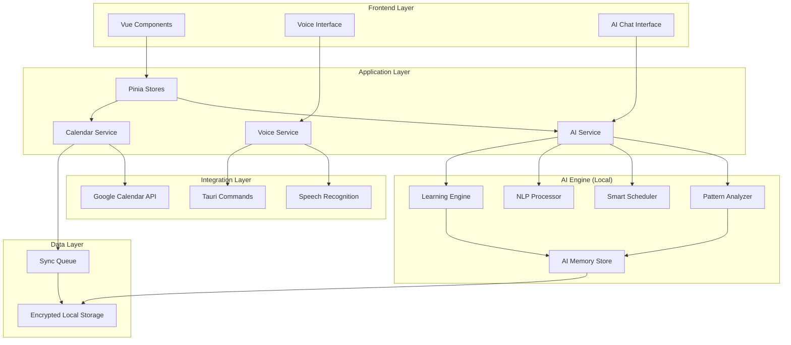

# Design Document: Felipe OS - AI & Calendar Integration (Fase 3)

## Overview

Felipe OS - AI & Calendar Integration (Fase 3) transforms the productivity system into an intelligent assistant that learns from Felipe's patterns and automates planning decisions. Unlike general-purpose AI assistants like Moltbot, this design is laser-focused on protecting deep work, respecting boundaries, and acting as an explicit assistant (never impersonation).

The architecture combines local AI processing for privacy, bidirectional Google Calendar sync for ecosystem integration, and voice commands for hands-free interaction. The AI Agent uses pattern recognition and machine learning to provide increasingly accurate suggestions while maintaining transparency and user control.

## Architecture

### High-Level Architecture



### Technology Stack

**AI/ML Stack**:
- **Local LLM**: Ollama with Llama 3.2 (3B) for on-device inference
- **Pattern Analysis**: TensorFlow.js for time series analysis
- **NLP**: compromise.js for natural language understanding
- **Speech**: macOS Speech Recognition API (native)

**Integration Stack**:
- **Google Calendar**: googleapis npm package with OAuth 2.0
- **Voice**: Web Speech API + macOS Speech Recognition
- **Sync**: Background workers with IndexedDB queue

**Security Stack**:
- **Encryption**: crypto-js for data at rest
- **OAuth**: PKCE flow for Google Calendar
- **Sandboxing**: Tauri security context for AI operations

## Components and Interfaces

### 1. AI Service Core

**Purpose**: Central orchestrator for all AI operations.

**Interface**:
```typescript
interface AIService {
  // Pattern Analysis
  analyzePatterns(timeRange: DateRange): Promise<PatternAnalysis>
  getWeeklyInsights(): Promise<InsightReport>
  
  // Smart Scheduling
  suggestBlocks(date: Date): Promise<BlockSuggestion[]>
  autoPlanDay(date: Date, oneThing?: string): Promise<DailyPlan>
  
  // Natural Language
  parseNaturalLanguage(input: string): Promise<ParsedIntent>
  
  // Proactive Suggestions
  getProactiveSuggestions(): Promise<Suggestion[]>
  
  // Learning
  recordAction(action: UserAction): Promise<void>
  updateModel(): Promise<void>
  
  // Memory
  getMemory(key: string): Promise<any>
  setMemory(key: string, value: any): Promise<void>
}
```

**Key Responsibilities**:
- Coordinate between AI sub-systems
- Manage AI memory and learning data
- Enforce privacy and security policies
- Handle AI errors gracefully

### 2. Pattern Analyzer

**Purpose**: Analyzes historical data to identify productivity patterns.

**Interface**:
```typescript
interface PatternAnalyzer {
  analyzeCompletionRates(blocks: Block[]): CompletionAnalysis
  identifyOptimalTimeSlots(category: Category): TimeSlot[]
  detectEnergyPatterns(reviews: ReviewEntry[]): EnergyPattern
  findRecurringMistakes(blocks: Block[]): Mistake[]
  calculateConfidence(pattern: Pattern): number
}

interface CompletionAnalysis {
  byTimeOfDay: Map<number, number>  // hour -> completion rate
  byCategory: Map<Category, number>
  byDuration: Map<number, number>
  byDayOfWeek: Map<number, number>
  trends: Trend[]
}

interface EnergyPattern {
  highEnergyHours: number[]
  lowEnergyHours: number[]
  optimalBlockDuration: number
  recoveryTimeNeeded: number
}
```

**Analysis Algorithms**:
- **Time Series Analysis**: Detect trends in completion rates
- **Clustering**: Group similar successful blocks
- **Correlation Analysis**: Find relationships between variables
- **Anomaly Detection**: Identify unusual patterns

### 3. Smart Scheduler

**Purpose**: Generates optimal block suggestions based on patterns and constraints.

**Interface**:
```typescript
interface SmartScheduler {
  suggestBlocks(context: SchedulingContext): Promise<BlockSuggestion[]>
  autoPlan(context: SchedulingContext): Promise<DailyPlan>
  resolveConflicts(blocks: Block[], events: CalendarEvent[]): Resolution[]
  optimizeSchedule(blocks: Block[]): OptimizedSchedule
}

interface SchedulingContext {
  date: Date
  oneThing?: string
  calendarEvents: CalendarEvent[]
  historicalPatterns: PatternAnalysis
  energyLevel?: number
  constraints: Constraint[]
}

interface BlockSuggestion {
  startTime: string
  endTime: string
  category: Category
  description: string
  confidence: number
  reasoning: string[]
}

interface DailyPlan {
  oneThing: string
  blocks: Block[]
  reasoning: string
  confidence: number
  alternatives: DailyPlan[]
}
```

**Scheduling Algorithm**:
```typescript
function generateOptimalSchedule(context: SchedulingContext): DailyPlan {
  // 1. Load historical patterns
  const patterns = context.historicalPatterns
  
  // 2. Identify available time slots
  const availableSlots = findAvailableSlots(
    context.calendarEvents,
    context.constraints
  )
  
  // 3. Score each slot for each category
  const scores = availableSlots.map(slot => ({
    slot,
    scores: {
      LANDINGCHAT: scoreSlot(slot, 'LANDINGCHAT', patterns),
      ESTUDIO: scoreSlot(slot, 'ESTUDIO', patterns),
      TAUSE: scoreSlot(slot, 'TAUSE', patterns),
      OTRO: scoreSlot(slot, 'OTRO', patterns)
    }
  }))
  
  // 4. Select top 3 blocks using greedy algorithm
  const selectedBlocks = selectTopBlocks(scores, 3)
  
  // 5. Generate reasoning
  const reasoning = explainSchedule(selectedBlocks, patterns)
  
  return {
    oneThing: context.oneThing || '',
    blocks: selectedBlocks,
    reasoning,
    confidence: calculateConfidence(selectedBlocks, patterns),
    alternatives: generateAlternatives(scores)
  }
}
```

### 4. NLP Processor

**Purpose**: Understands natural language input for planning.

**Interface**:
```typescript
interface NLPProcessor {
  parse(input: string, language: 'en' | 'es'): Promise<ParsedIntent>
  extractTimeReferences(text: string): TimeReference[]
  extractCategories(text: string): Category[]
  extractDurations(text: string): number[]
  extractConstraints(text: string): Constraint[]
}

interface ParsedIntent {
  action: 'create_block' | 'plan_day' | 'query' | 'modify'
  blocks: BlockIntent[]
  constraints: Constraint[]
  confidence: number
  ambiguities: string[]
}

interface BlockIntent {
  category: Category
  timeReference: TimeReference
  duration?: number
  description?: string
}

interface TimeReference {
  type: 'absolute' | 'relative' | 'named'
  value: string  // "9am", "after meeting", "morning"
  resolvedTime?: string
}
```

**NLP Pipeline**:
```typescript
function parseNaturalLanguage(input: string): ParsedIntent {
  // 1. Tokenize and normalize
  const tokens = tokenize(input.toLowerCase())
  
  // 2. Extract entities
  const categories = extractCategories(tokens)
  const times = extractTimeReferences(tokens)
  const durations = extractDurations(tokens)
  
  // 3. Resolve references
  const resolvedTimes = resolveTimes(times, getCurrentContext())
  
  // 4. Build intent
  const intent = buildIntent(categories, resolvedTimes, durations)
  
  // 5. Validate and check ambiguities
  const validated = validateIntent(intent)
  
  return validated
}
```

**Example Patterns**:
```typescript
const patterns = {
  timeReferences: {
    morning: { start: '08:00', end: '12:00' },
    afternoon: { start: '12:00', end: '17:00' },
    early: { start: '08:00', end: '10:00' },
    late: { start: '15:00', end: '17:00' }
  },
  
  durations: {
    'quick': 30,
    'short': 30,
    'normal': 90,
    'deep work': 90,
    'long': 120,
    'extended': 120
  },
  
  categoryAliases: {
    'lc': 'LANDINGCHAT',
    'landingchat': 'LANDINGCHAT',
    'study': 'ESTUDIO',
    'estudiar': 'ESTUDIO',
    'tause': 'TAUSE',
    'other': 'OTRO',
    'otro': 'OTRO'
  }
}
```

### 5. Google Calendar Service

**Purpose**: Manages bidirectional sync with Google Calendar.

**Interface**:
```typescript
interface CalendarService {
  // Authentication
  authenticate(): Promise<void>
  isAuthenticated(): boolean
  revokeAccess(): Promise<void>
  
  // Sync Operations
  syncBlocks(blocks: Block[]): Promise<SyncResult>
  syncFromGoogle(): Promise<CalendarEvent[]>
  startAutoSync(intervalMs: number): void
  stopAutoSync(): void
  
  // Conflict Detection
  detectConflicts(blocks: Block[]): Promise<Conflict[]>
  resolveConflict(conflict: Conflict, resolution: Resolution): Promise<void>
  
  // Event Management
  createEvent(block: Block): Promise<string>  // returns eventId
  updateEvent(eventId: string, block: Block): Promise<void>
  deleteEvent(eventId: string): Promise<void>
}

interface SyncResult {
  created: number
  updated: number
  deleted: number
  errors: SyncError[]
}

interface Conflict {
  type: 'hard' | 'soft' | 'none'
  block: Block
  event: CalendarEvent
  suggestions: Block[]
}

interface CalendarEvent {
  id: string
  summary: string
  start: string
  end: string
  source: 'felipe-os' | 'external'
  colorId?: string
}
```

**Sync Strategy**:
```typescript
class CalendarSyncManager {
  private syncQueue: SyncQueue
  private lastSyncToken: string | null = null
  
  async sync(): Promise<SyncResult> {
    // 1. Get changes from Google Calendar
    const googleChanges = await this.getGoogleChanges(this.lastSyncToken)
    
    // 2. Get local changes
    const localChanges = await this.syncQueue.getChanges()
    
    // 3. Detect conflicts
    const conflicts = this.detectConflicts(googleChanges, localChanges)
    
    // 4. Resolve conflicts (last-write-wins for now)
    const resolved = this.resolveConflicts(conflicts)
    
    // 5. Apply changes
    const result = await this.applyChanges(resolved)
    
    // 6. Update sync token
    this.lastSyncToken = googleChanges.nextSyncToken
    
    return result
  }
  
  private detectConflicts(
    googleChanges: Change[],
    localChanges: Change[]
  ): Conflict[] {
    // Detect conflicts by comparing timestamps
    // Felipe OS changes always win (user is in control)
    return []
  }
}
```

### 6. Voice Service

**Purpose**: Handles voice commands and responses.

**Interface**:
```typescript
interface VoiceService {
  // Recognition
  startListening(wakeWord: string): void
  stopListening(): void
  isListening(): boolean
  
  // Commands
  processCommand(transcript: string): Promise<VoiceResponse>
  
  // Synthesis
  speak(text: string, language: 'en' | 'es'): Promise<void>
  stopSpeaking(): void
  
  // Configuration
  setWakeWord(word: string): void
  setLanguage(language: 'en' | 'es'): void
  setVoice(voice: string): void
}

interface VoiceResponse {
  action: string
  result: any
  spokenResponse: string
  visualFeedback: string
}
```

**Voice Command Mapping**:
```typescript
const voiceCommands = {
  'plan my day': async () => {
    const plan = await aiService.autoPlanDay(new Date())
    return {
      action: 'auto_plan',
      result: plan,
      spokenResponse: `I've planned your day with ${plan.blocks.length} blocks`,
      visualFeedback: 'Daily plan created'
    }
  },
  
  'start focus': async () => {
    await focusStore.startFocusMode()
    return {
      action: 'start_focus',
      result: true,
      spokenResponse: 'Focus mode activated. Good luck!',
      visualFeedback: 'Focus mode started'
    }
  },
  
  'what\'s next': async () => {
    const nextBlock = blocksStore.getNextBlock()
    return {
      action: 'query_next',
      result: nextBlock,
      spokenResponse: `Next up: ${nextBlock.description} at ${nextBlock.startTime}`,
      visualFeedback: 'Next block shown'
    }
  }
}
```

### 7. Learning Engine

**Purpose**: Continuously learns from user actions to improve suggestions.

**Interface**:
```typescript
interface LearningEngine {
  recordAction(action: UserAction): Promise<void>
  updateModel(): Promise<void>
  getConfidence(suggestionType: string): number
  resetLearning(): Promise<void>
  exportLearningData(): Promise<LearningData>
}

interface UserAction {
  type: 'block_created' | 'block_modified' | 'block_deleted' | 
        'block_completed' | 'suggestion_accepted' | 'suggestion_rejected'
  timestamp: Date
  data: any
  context: ActionContext
}

interface ActionContext {
  timeOfDay: number
  dayOfWeek: number
  existingBlocks: Block[]
  calendarEvents: CalendarEvent[]
  energyLevel?: number
}

interface LearningData {
  version: string
  actions: UserAction[]
  patterns: Pattern[]
  confidenceScores: Map<string, number>
  lastUpdated: Date
}
```

**Learning Algorithm**:
```typescript
class SimpleLearningEngine {
  private actions: UserAction[] = []
  private patterns: Map<string, Pattern> = new Map()
  
  async recordAction(action: UserAction): Promise<void> {
    this.actions.push(action)
    
    // Update patterns incrementally
    if (action.type === 'suggestion_accepted') {
      this.reinforcePattern(action)
    } else if (action.type === 'suggestion_rejected') {
      this.weakenPattern(action)
    }
  }
  
  async updateModel(): Promise<void> {
    // Run weekly to update patterns
    const recentActions = this.actions.filter(a => 
      a.timestamp > subDays(new Date(), 7)
    )
    
    // Analyze patterns
    const newPatterns = this.analyzePatterns(recentActions)
    
    // Merge with existing patterns
    this.patterns = this.mergePatterns(this.patterns, newPatterns)
    
    // Update confidence scores
    this.updateConfidenceScores()
  }
  
  private reinforcePattern(action: UserAction): void {
    const patternKey = this.getPatternKey(action)
    const pattern = this.patterns.get(patternKey)
    
    if (pattern) {
      pattern.weight += 0.1
      pattern.successCount += 1
    } else {
      this.patterns.set(patternKey, {
        key: patternKey,
        weight: 1.0,
        successCount: 1,
        totalCount: 1
      })
    }
  }
}
```

### 8. AI Memory Store

**Purpose**: Persistent storage for AI learning and context.

**Interface**:
```typescript
interface AIMemoryStore {
  // Patterns
  savePattern(pattern: Pattern): Promise<void>
  getPattern(key: string): Promise<Pattern | null>
  getAllPatterns(): Promise<Pattern[]>
  
  // Context
  saveContext(key: string, value: any): Promise<void>
  getContext(key: string): Promise<any>
  
  // Preferences
  savePreference(key: string, value: any): Promise<void>
  getPreference(key: string): Promise<any>
  
  // History
  saveAction(action: UserAction): Promise<void>
  getActions(filter: ActionFilter): Promise<UserAction[]>
  
  // Cleanup
  clearOldData(beforeDate: Date): Promise<void>
  exportAll(): Promise<MemoryExport>
  importAll(data: MemoryExport): Promise<void>
}
```

**Storage Schema**:
```typescript
interface MemorySchema {
  patterns: {
    [key: string]: Pattern
  }
  context: {
    [key: string]: any
  }
  preferences: {
    [key: string]: any
  }
  actions: UserAction[]
  metadata: {
    version: string
    lastUpdated: Date
    totalActions: number
  }
}
```

## Data Models

### Core AI Data Structures

```typescript
interface Pattern {
  key: string
  type: 'time_preference' | 'category_preference' | 'duration_preference' | 'energy_pattern'
  weight: number
  successCount: number
  totalCount: number
  confidence: number
  data: any
  lastUpdated: Date
}

interface Suggestion {
  id: string
  type: 'block' | 'schedule' | 'insight' | 'reminder'
  priority: 'low' | 'medium' | 'high'
  content: string
  reasoning: string[]
  confidence: number
  actions: SuggestionAction[]
  expiresAt: Date
}

interface SuggestionAction {
  label: string
  action: () => Promise<void>
  type: 'accept' | 'reject' | 'modify'
}

interface InsightReport {
  period: DateRange
  summary: string
  insights: Insight[]
  recommendations: Recommendation[]
  charts: ChartData[]
}

interface Insight {
  category: string
  title: string
  description: string
  impact: 'positive' | 'negative' | 'neutral'
  confidence: number
  data: any
}

interface Recommendation {
  title: string
  description: string
  priority: 'low' | 'medium' | 'high'
  actions: string[]
  expectedImpact: string
}
```

## Correctness Properties

### Property 1: Calendar Sync Consistency
*For any* block operation (create, update, delete), the corresponding Google Calendar event should reflect the change within 5 seconds, and vice versa for external events.
**Validates: Requirements 1.1, 1.2, 1.3, 1.7**

### Property 2: Conflict Detection Accuracy
*For any* set of blocks and calendar events, the system should correctly identify all hard conflicts (overlaps) and soft conflicts (adjacent with <15min gap).
**Validates: Requirements 2.1, 2.2, 2.6**

### Property 3: Pattern Analysis Correctness
*For any* historical dataset with at least 2 weeks of data, the pattern analyzer should produce consistent results when run multiple times on the same data.
**Validates: Requirements 3.1, 3.2, 3.3, 3.4**

### Property 4: Smart Scheduling Constraints
*For any* scheduling request, the AI Agent should never suggest more than 3 blocks, never suggest blocks after 5pm (unless override), and always respect the Sacred Block limit.
**Validates: Requirements 4.10, 5.8, 5.9**

### Property 5: Suggestion Confidence Accuracy
*For any* suggestion with confidence >80%, the acceptance rate should be >70% over time, demonstrating that confidence scores are calibrated.
**Validates: Requirements 4.7, 10.4**

### Property 6: Natural Language Parsing Consistency
*For any* natural language input, parsing the same input multiple times should produce identical results.
**Validates: Requirements 8.1, 8.2, 8.3, 8.4**

### Property 7: Learning Convergence
*For any* pattern with >20 data points, the confidence score should stabilize (change <5% per week) indicating the model has learned the pattern.
**Validates: Requirements 10.1, 10.2, 10.3**

### Property 8: Privacy Guarantee
*For any* AI operation, no data should be sent to external servers (except Google Calendar API for sync), and all AI processing should happen locally.
**Validates: Requirements 3.9, 11.1, 11.5**

### Property 9: Voice Command Reliability
*For any* supported voice command, the system should correctly interpret and execute the command with >90% accuracy.
**Validates: Requirements 7.2, 7.3, 7.4**

### Property 10: Proactive Suggestion Limits
*For any* day, the AI Agent should never send more than 2 proactive suggestions, and never interrupt during Focus Mode.
**Validates: Requirements 6.7, 6.9**

### Property 11: Auto-Plan Validity
*For any* auto-generated daily plan, all blocks should respect time boundaries, category priorities, and not conflict with calendar events.
**Validates: Requirements 5.1, 5.4, 5.8, 5.9**

### Property 12: Sync Queue Reliability
*For any* network outage, all changes should be queued and successfully synced when connection is restored, with no data loss.
**Validates: Requirements 1.8, 12.7**

## Error Handling

### AI Service Errors

**Model Loading Failures**:
- Fallback to rule-based suggestions if ML model fails
- Show user-friendly error message
- Log error for debugging
- Continue operation with reduced functionality

**Pattern Analysis Errors**:
- Handle insufficient data gracefully (min 2 weeks required)
- Provide default suggestions based on best practices
- Notify user of low confidence

**NLP Parsing Errors**:
- Ask for clarification when input is ambiguous
- Provide examples of valid input
- Fall back to manual block creation

### Calendar Sync Errors

**Authentication Failures**:
- Prompt user to re-authenticate
- Continue offline operation
- Queue changes for later sync

**API Rate Limiting**:
- Implement exponential backoff
- Batch operations to reduce API calls
- Show user-friendly message about delays

**Conflict Resolution Failures**:
- Present conflicts to user for manual resolution
- Provide clear options and recommendations
- Never auto-resolve without user consent

### Voice Service Errors

**Recognition Failures**:
- Ask user to repeat command
- Provide visual feedback of what was heard
- Fall back to text input

**Synthesis Failures**:
- Show visual feedback only
- Log error for debugging
- Continue operation silently

## Testing Strategy

### Unit Testing
- Test each AI component in isolation
- Mock external dependencies (Google Calendar, Speech API)
- Test edge cases and error conditions

### Property-Based Testing
- Use fast-check for property tests
- Generate random historical data for pattern analysis
- Test scheduling algorithms with various constraints
- Validate NLP parsing with generated inputs

### Integration Testing
- Test full AI workflow: analysis → suggestion → acceptance → learning
- Test calendar sync with mock Google Calendar API
- Test voice commands end-to-end

### Performance Testing
- Benchmark AI operations (<2s for suggestions)
- Test calendar sync performance (<5s)
- Monitor memory usage (<100MB for AI)
- Test with large datasets (1 year of history)

### Security Testing
- Verify no data leaks to external servers
- Test encryption of AI memory
- Validate OAuth flow security
- Test sandbox isolation

## Implementation Notes

### Phase 1: Foundation (Weeks 1-2)
- Set up Google Calendar OAuth and API integration
- Implement basic sync (create, update, delete)
- Build conflict detection
- Create AI memory store

### Phase 2: AI Core (Weeks 3-4)
- Implement pattern analyzer
- Build smart scheduler
- Create NLP processor
- Implement learning engine

### Phase 3: User Interface (Weeks 5-6)
- Build AI chat interface
- Implement voice commands
- Create suggestion UI
- Add insight reports

### Phase 4: Polish & Testing (Weeks 7-8)
- Comprehensive testing
- Performance optimization
- Security audit
- Documentation

### Technology Choices

**Why Ollama + Llama 3.2?**
- Runs locally for privacy
- Small model (3B) fits in memory
- Fast inference (<2s)
- Good at instruction following

**Why TensorFlow.js?**
- Runs in browser/Node.js
- Good for time series analysis
- Lightweight and fast

**Why compromise.js?**
- Lightweight NLP library
- Good for entity extraction
- No external dependencies

**Why not use OpenAI/Claude?**
- Privacy concerns (data leaves device)
- Latency issues (network calls)
- Cost considerations
- Dependency on external service
