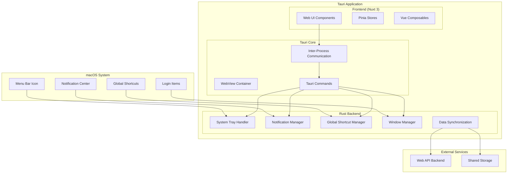

# Design Document: Felipe OS - App Nativa macOS (Fase 2)

## Overview

Felipe OS - App Nativa macOS (Fase 2) transforms the existing web MVP into a native macOS application using Tauri v1.x. The design maintains the core functionality while adding native system integration features that enhance productivity and user experience. The architecture leverages Tauri's hybrid approach, combining the existing Nuxt 3 frontend with a Rust backend for native system access.

The application follows macOS design principles and integrates seamlessly with the operating system through menu bar presence, native notifications, global shortcuts, and system APIs. The design prioritizes performance, security, and user experience while maintaining the simplicity that makes Felipe OS effective.

## Architecture

### High-Level Architecture



### Component Architecture

The application consists of three main layers:

1. **Frontend Layer (Nuxt 3)**: Existing web application with minimal modifications
2. **Tauri Bridge Layer**: IPC communication and command handling
3. **Native Backend Layer (Rust)**: System integration and native functionality

### Technology Stack

- **Frontend**: Nuxt 3, Vue 3, TypeScript, Pinia
- **Native Framework**: Tauri v1.x
- **Backend**: Rust with Tauri APIs
- **Build System**: Vite (frontend), Cargo (backend)
- **Distribution**: macOS App Bundle (.app)

## Components and Interfaces

### 1. System Tray Manager

**Purpose**: Manages the persistent menu bar icon and dropdown menu.

**Key Responsibilities**:
- Create and maintain menu bar icon
- Handle menu item clicks and state updates
- Provide quick access to core functions
- Display current focus mode status

**Interface**:
```rust
pub struct SystemTrayManager {
    tray: SystemTray,
    menu: SystemTrayMenu,
}

impl SystemTrayManager {
    pub fn new() -> Self;
    pub fn update_status(&mut self, status: FocusStatus);
    pub fn show_menu(&self);
    pub fn handle_menu_event(&self, event: SystemTrayEvent);
}
```

**Menu Structure**:
- Focus Mode Toggle
- Start Zona Roja
- Take Break
- Show/Hide Main Window
- Settings
- Quit

### 2. Notification Manager

**Purpose**: Handles native macOS notifications for focus events.

**Key Responsibilities**:
- Send system notifications for focus events
- Request notification permissions
- Handle notification interactions
- Respect system Do Not Disturb settings

**Interface**:
```rust
pub struct NotificationManager {
    permission_granted: bool,
}

impl NotificationManager {
    pub fn new() -> Self;
    pub async fn request_permission(&mut self) -> Result<bool>;
    pub fn send_focus_start(&self, session: &FocusSession);
    pub fn send_zona_roja(&self);
    pub fn send_session_complete(&self, summary: &SessionSummary);
    pub fn send_break_reminder(&self);
}
```

### 3. Global Shortcut Manager

**Purpose**: Manages system-wide keyboard shortcuts.

**Key Responsibilities**:
- Register global keyboard shortcuts
- Handle shortcut conflicts
- Allow shortcut customization
- Provide feedback for shortcut actions

**Interface**:
```rust
pub struct GlobalShortcutManager {
    shortcuts: HashMap<String, GlobalShortcut>,
}

impl GlobalShortcutManager {
    pub fn new() -> Self;
    pub fn register_shortcut(&mut self, key: &str, callback: Box<dyn Fn()>);
    pub fn unregister_shortcut(&mut self, key: &str);
    pub fn update_shortcut(&mut self, key: &str, new_binding: &str);
}
```

**Default Shortcuts**:
- `Cmd+Shift+F`: Toggle Focus Mode
- `Cmd+Shift+Z`: Start Zona Roja
- `Cmd+Shift+B`: Take Break
- `Cmd+Shift+S`: Show/Hide Main Window

### 4. Window Manager

**Purpose**: Manages application windows and their behavior.

**Key Responsibilities**:
- Control main window visibility and state
- Manage floating window during focus mode
- Handle window positioning and sizing
- Implement auto-launch functionality

**Interface**:
```rust
pub struct WindowManager {
    main_window: Option<Window>,
    floating_window: Option<Window>,
}

impl WindowManager {
    pub fn new() -> Self;
    pub fn show_main_window(&mut self);
    pub fn hide_main_window(&mut self);
    pub fn create_floating_window(&mut self) -> Result<()>;
    pub fn destroy_floating_window(&mut self);
    pub fn set_auto_launch(&self, enabled: bool) -> Result<()>;
}
```

### 5. Data Synchronization Manager

**Purpose**: Synchronizes data between native app and web version.

**Key Responsibilities**:
- Sync data with shared backend
- Handle offline scenarios
- Resolve data conflicts
- Maintain data consistency

**Interface**:
```rust
pub struct DataSyncManager {
    api_client: ApiClient,
    local_storage: LocalStorage,
}

impl DataSyncManager {
    pub fn new(api_endpoint: &str) -> Self;
    pub async fn sync_data(&mut self) -> Result<()>;
    pub async fn push_changes(&self, changes: &[DataChange]) -> Result<()>;
    pub async fn pull_updates(&mut self) -> Result<Vec<DataUpdate>>;
    pub fn handle_conflict(&self, conflict: &DataConflict) -> Resolution;
}
```

### 6. Tauri Commands Interface

**Purpose**: Exposes Rust functionality to the frontend via IPC.

**Commands**:
```rust
#[tauri::command]
async fn toggle_focus_mode() -> Result<FocusStatus>;

#[tauri::command]
async fn start_zona_roja() -> Result<()>;

#[tauri::command]
async fn take_break() -> Result<()>;

#[tauri::command]
async fn update_tray_status(status: FocusStatus) -> Result<()>;

#[tauri::command]
async fn show_floating_window() -> Result<()>;

#[tauri::command]
async fn hide_floating_window() -> Result<()>;

#[tauri::command]
async fn set_auto_launch(enabled: bool) -> Result<()>;

#[tauri::command]
async fn update_global_shortcut(action: String, shortcut: String) -> Result<()>;
```

## Data Models

### Core Data Structures

```rust
#[derive(Serialize, Deserialize, Clone)]
pub struct FocusSession {
    pub id: String,
    pub start_time: DateTime<Utc>,
    pub duration_minutes: u32,
    pub session_type: SessionType,
    pub status: SessionStatus,
}

#[derive(Serialize, Deserialize, Clone)]
pub enum SessionType {
    Focus,
    ZonaRoja,
    Break,
}

#[derive(Serialize, Deserialize, Clone)]
pub enum SessionStatus {
    Active,
    Paused,
    Completed,
    Cancelled,
}

#[derive(Serialize, Deserialize, Clone)]
pub struct FocusStatus {
    pub is_active: bool,
    pub current_session: Option<FocusSession>,
    pub time_remaining: Option<Duration>,
    pub session_type: Option<SessionType>,
}

#[derive(Serialize, Deserialize, Clone)]
pub struct AppSettings {
    pub auto_launch: bool,
    pub notifications_enabled: bool,
    pub global_shortcuts: HashMap<String, String>,
    pub floating_window_position: Option<(i32, i32)>,
    pub menu_bar_icon_style: IconStyle,
}

#[derive(Serialize, Deserialize, Clone)]
pub enum IconStyle {
    Default,
    Minimal,
    StatusIndicator,
}
```

### Frontend Data Integration

The frontend maintains its existing Pinia stores while adding new composables for native functionality:

```typescript
// composables/useNativeFeatures.ts
export const useNativeFeatures = () => {
  const toggleFocusMode = async () => {
    return await invoke('toggle_focus_mode');
  };
  
  const startZonaRoja = async () => {
    return await invoke('start_zona_roja');
  };
  
  const updateTrayStatus = async (status: FocusStatus) => {
    return await invoke('update_tray_status', { status });
  };
  
  return {
    toggleFocusMode,
    startZonaRoja,
    updateTrayStatus,
  };
};
```

## Correctness Properties

*A property is a characteristic or behavior that should hold true across all valid executions of a system-essentially, a formal statement about what the system should do. Properties serve as the bridge between human-readable specifications and machine-verifiable correctness guarantees.*

### Property 1: Tauri Build Consistency
*For any* valid Nuxt 3 frontend configuration, building the Tauri app should produce a valid macOS .app bundle that contains all frontend assets and maintains functional equivalence with the web version
**Validates: Requirements 1.1, 1.2, 1.3, 1.4**

### Property 2: Menu Bar Persistence
*For any* app lifecycle state, the menu bar icon should remain visible and functional, providing access to core actions regardless of main window visibility
**Validates: Requirements 2.1, 2.2, 2.3, 2.5**

### Property 3: Menu Bar Termination
*For any* running app instance, selecting "Quit" from the menu bar should completely terminate the application process
**Validates: Requirements 2.4**

### Property 4: Event-Driven Notifications
*For any* focus-related event (start, zona roja, completion, break), the system should send an appropriate native notification with correct priority and content
**Validates: Requirements 3.1, 3.2, 3.3, 3.4**

### Property 5: Notification Permission Handling
*For any* notification request, the app should properly request and handle user authorization according to macOS guidelines
**Validates: Requirements 3.5**

### Property 6: Global Shortcut Actions
*For any* registered global shortcut, pressing the key combination should trigger the corresponding action (focus toggle, zona roja, break, window visibility) regardless of the currently active application
**Validates: Requirements 4.1, 4.2, 4.3, 4.4**

### Property 7: Shortcut Conflict Resolution
*For any* shortcut conflict scenario, the app should handle conflicts gracefully and allow users to customize shortcut bindings
**Validates: Requirements 4.5**

### Property 8: Floating Window Lifecycle
*For any* focus mode session, activating focus mode should create an always-on-top floating window that displays session information and automatically hides when focus mode ends
**Validates: Requirements 5.1, 5.2, 5.4**

### Property 9: Floating Window Position Persistence
*For any* floating window position change, the new position should be saved and restored in future focus sessions
**Validates: Requirements 5.3**

### Property 10: Floating Window Accessibility
*For any* floating window state, the window should be easily dismissible but remain accessible during focus sessions
**Validates: Requirements 5.5**

### Property 11: Auto-Launch Configuration
*For any* auto-launch setting change, enabling should add the app to macOS login items and disabling should remove it, with appropriate permission handling
**Validates: Requirements 6.2, 6.4, 6.5**

### Property 12: Auto-Launch Startup Behavior
*For any* auto-launched app instance, the app should start minimized to menu bar without showing the main window
**Validates: Requirements 6.3**

### Property 13: Data Synchronization Consistency
*For any* data modification in the native app, changes should be synced to the shared backend and the app should load the most recent data on startup
**Validates: Requirements 7.1, 7.3**

### Property 14: Concurrent Data Handling
*For any* concurrent data modification scenario, the app should detect conflicts and resolve them using the specified strategy (last-write-wins or user intervention)
**Validates: Requirements 7.2, 7.5**

### Property 15: Offline Data Queuing
*For any* network connectivity loss, data changes should be queued and synced when connection is restored
**Validates: Requirements 7.4**

### Property 16: Native macOS Integration
*For any* system interaction (notifications, permissions, Do Not Disturb), the app should use appropriate macOS APIs and follow platform guidelines
**Validates: Requirements 8.1, 8.2, 8.3, 8.4, 8.5**

### Property 17: Resource Efficiency
*For any* app state (background, hidden window, focus mode), resource usage should remain within acceptable limits and adapt to system conditions
**Validates: Requirements 9.1, 9.2, 9.3, 9.4, 9.5**

### Property 18: Settings Configuration
*For any* native-specific setting (shortcuts, notifications, auto-launch), changes should be immediately applied without requiring restart and should respect system preferences
**Validates: Requirements 10.1, 10.2, 10.3, 10.4, 10.5**

## Error Handling

### System Integration Errors

**Menu Bar Creation Failures**:
- Fallback to standard window mode if system tray is unavailable
- Log errors and notify user of reduced functionality
- Provide manual window access through dock icon

**Notification Permission Denied**:
- Gracefully disable notification features
- Provide alternative feedback mechanisms (menu bar status, floating window)
- Allow users to re-enable notifications through settings

**Global Shortcut Registration Failures**:
- Handle shortcut conflicts by offering alternative bindings
- Provide clear error messages for unavailable shortcuts
- Allow manual shortcut configuration in settings

**Auto-Launch Permission Issues**:
- Handle security restrictions gracefully
- Provide clear instructions for manual setup
- Fallback to manual launch with user notification

### Data Synchronization Errors

**Network Connectivity Issues**:
- Queue changes locally during offline periods
- Implement exponential backoff for retry attempts
- Provide clear offline/online status indicators

**Data Conflict Resolution**:
- Implement last-write-wins strategy by default
- Provide user intervention option for critical conflicts
- Maintain conflict history for debugging

**Backend API Failures**:
- Implement circuit breaker pattern for API calls
- Provide local-only mode during extended outages
- Cache critical data for offline operation

### Resource Management Errors

**Memory Pressure**:
- Implement memory monitoring and cleanup
- Reduce background operations under pressure
- Provide graceful degradation of features

**Performance Issues**:
- Monitor timing accuracy during focus sessions
- Adjust update frequencies based on system load
- Prioritize critical functions over UI updates

## Testing Strategy

### Dual Testing Approach

The testing strategy combines unit tests for specific scenarios with property-based tests for comprehensive coverage:

**Unit Tests Focus**:
- Specific integration scenarios between Tauri and macOS APIs
- Error condition handling and edge cases
- User interaction flows and state transitions
- Platform-specific behavior validation

**Property-Based Tests Focus**:
- Universal properties across all system states
- Data synchronization consistency across network conditions
- Resource usage patterns under various loads
- Cross-platform behavior validation

### Property-Based Testing Configuration

**Framework**: Use `proptest` for Rust backend and `fast-check` for TypeScript frontend
**Minimum Iterations**: 100 per property test to ensure comprehensive coverage
**Test Tagging**: Each property test references its design document property

Example test structure:
```rust
#[cfg(test)]
mod tests {
    use proptest::prelude::*;
    
    // Feature: felipe-os-macos-native, Property 1: Tauri Build Consistency
    proptest! {
        #[test]
        fn tauri_build_maintains_frontend_equivalence(
            config in any::<NuxtConfig>()
        ) {
            let bundle = build_tauri_app(config.clone());
            assert!(bundle.is_valid_macos_bundle());
            assert!(bundle.contains_all_frontend_assets(&config));
            assert!(bundle.maintains_functional_equivalence());
        }
    }
}
```

### Integration Testing

**System Integration Tests**:
- Menu bar icon creation and interaction
- Global shortcut registration and handling
- Notification system integration
- Auto-launch functionality

**Cross-Platform Data Tests**:
- Data synchronization between web and native versions
- Offline/online state transitions
- Conflict resolution scenarios

**Performance Tests**:
- Resource usage monitoring during extended sessions
- Memory leak detection
- Timing accuracy validation

### Manual Testing Scenarios

**User Experience Validation**:
- First-run setup experience
- Permission request flows
- Settings configuration workflows
- Focus session user journeys

**System Integration Validation**:
- Behavior with other menu bar apps
- Integration with macOS Do Not Disturb
- Compatibility across macOS versions (12+)

### Continuous Integration

**Automated Testing Pipeline**:
- Unit and property tests on every commit
- Integration tests on pull requests
- Performance regression tests on releases
- Cross-version compatibility tests

**Build Validation**:
- Automated .app bundle creation and validation
- Code signing and notarization testing
- Distribution package verification

The testing strategy ensures both correctness and reliability while maintaining the high-quality user experience expected from native macOS applications.